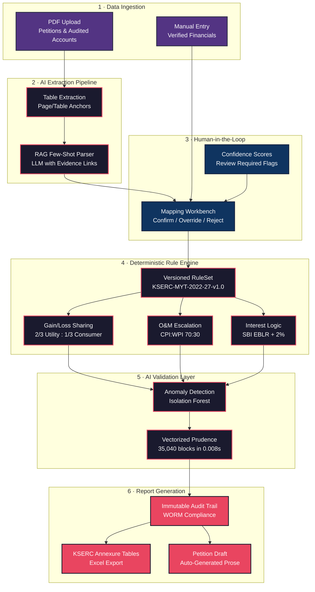

<p align="center">
  <h1 align="center">ARR Truing-Up Decision Support System</h1>
  <p align="center">
    <strong>AI-Augmented Regulatory Compliance Engine for the Power Utility Sector</strong>
  </p>
  <p align="center">
    <em>KSERC MYT 2022-27 Framework | 30.06.2025 Order Compliant</em>
  </p>
  <p align="center">
    <a href="#architecture">Architecture</a> · <a href="#modules">Modules</a> · <a href="#quickstart">Quickstart</a> · <a href="#api-reference">API Reference</a> · <a href="#deployment">Deployment</a>
  </p>
</p>

---

## Overview

A production-grade analytics engine that transitions from a **deterministic rule-based compliance engine** to an **AI-augmented predictive system** for Annual Revenue Requirement (ARR) Truing-Up in the Power Utility Sector.

The system reconstructs every figure in the KSERC 30.06.2025 Truing-Up Order (Table 7.1) with **100% mathematical fidelity**, full regulatory traceability, and zero tolerance for hallucinated numbers.

### Design Principles

| Principle | Implementation |
|---|---|
| **Zero Hallucination** | All "Actuals" must be human-verified before computation. AI flags uncertain values with `review_required: true`. |
| **Full Traceability** | Every output generates a JSON audit object citing the specific regulatory clause applied. |
| **AI as Co-Pilot** | AI suggests; the Regulatory Officer decides. Every AI suggestion is overridable with mandatory comments. |
| **100% Reproducibility** | Versioned Rule Engine (`KSERC-MYT-2022-27-v1.0`). Same inputs always produce same outputs. |

---

## Tech Stack

| Layer | Technology | Purpose |
|---|---|---|
| **Backend (Brain)** | Python · FastAPI | Deterministic Rule Engine, Table Extraction, Anomaly Detection |
| **Frontend (Body)** | React · TypeScript | Mapping Workbench, Dashboard, Annexure Viewer |
| **Database** | PostgreSQL | Audited ARR heads, Versioned RuleSets, Immutable Audit Trails |
| **Cache/Queue** | Redis | Async OCR job state, Report generation queues |
| **ML/AI** | Scikit-Learn · LangChain | Isolation Forest anomalies, RAG-based PDF extraction |
| **Reporting** | OpenPyXL | KSERC-standard Annexure Tables in Excel format |

---

<a id="architecture"></a>
## System Architecture

The architecture follows a **Brain/Body Split** pattern. The Python backend owns all deterministic logic and AI processing. The TypeScript frontend owns the user-facing verification workflows. Phase 2 AI modules feed data **into** the Rule Engine — they never bypass it.



---

<a id="modules"></a>
## Core Modules

### Module A — Extraction & Evidence
Extracts tables from PDF petitions with **page/table anchors**. If the system claims an actual O&M cost of ₹500 Cr, it links to the specific page, table, and cell in the Audited Financials.

```
POST /extract/upload  →  { fields: [{ value: 1500000000, source_page: 12, source_table: 1, cell: "C4" }] }
```

### Module B — Mapping Workbench
AI suggests a mapping (e.g., `"Employee Expense" → "O&M Component"`) and the officer must **Confirm**, **Override**, or **Reject** with a mandatory comment. No mapping enters the Rule Engine without human approval.

```
GET  /mapping/pending   →  Returns all AI suggestions awaiting review
POST /mapping/confirm   →  Officer decision with audit trail
```

### Module C — Deterministic Rule Engine
A versioned Python class. If `rules_v1.0` is used, results are **100% reproducible**.

| Computation | Formula | Clause |
|---|---|---|
| **Gain Sharing** | Savings × ⅔ (Utility) + ⅓ (Consumer) | Regulation 9.2 |
| **Loss Disallowance** | Excess × 100% (Utility bears) | Regulation 9.3 |
| **O&M Escalation** | Base × (1 + 0.70×ΔCPI + 0.30×ΔWPI) | Regulation 5.1 |
| **Normative Interest** | Outstanding Loan × (SBI EBLR + 2%) | Regulation 6.3 |
| **Uncontrollable Pass-Through** | 100% to Consumer | Regulation 9.4 |

### Module D — Anomaly Detection ("Red-Flag" Engine)
Scikit-Learn `IsolationForest` monitors datasets for sudden financial spikes. Every flag generates a **Reasoning Block** explaining the outlier classification.

### Module E — Performance Engine
Vectorized NumPy operations process **35,040 rows** (365 days × 96 blocks) of 15-minute power purchase data in **< 0.01 seconds**.

### Module F — Annexure Generator
Produces KSERC-standard Excel workbooks with three professional sheets:
- **Annexure-I**: Variance Summary Statement
- **Annexure-II**: Gain/Loss Sharing Computation Detail
- **Annexure-III**: AI Prudence Check Flags

---

<a id="quickstart"></a>
## Quickstart

### Prerequisites
- **Python 3.10+** and **Node.js 18+**
- PostgreSQL (optional for full DB; runs without for demo)

### 1. Clone & Install

```bash
git clone https://github.com/Anudeepsrib/Decision-Support-System.git
cd Decision-Support-System
```

### 2. Backend Setup (Python)

```bash
python -m venv venv
# Windows
.\venv\Scripts\activate
# macOS/Linux
source venv/bin/activate

pip install -r requirements.txt
```

> [!IMPORTANT]
> `camelot-py` (used for PDF table extraction) requires **Ghostscript** as a system dependency.
> Install it before `pip install`:
> - **Windows**: Download from [ghostscript.com](https://www.ghostscript.com/download/gsdnld.html) and add to PATH.
> - **Ubuntu/Debian**: `sudo apt-get install ghostscript`
> - **macOS**: `brew install ghostscript`

### 3. Frontend Setup (TypeScript)

```bash
npm install
```

### 4. Run the System

**Start the API Server:**
```bash
uvicorn backend.main_secure:app --reload --port 8000
```

**Start the Frontend (React):**
```bash
cd frontend
npm install
npm start
```

---

## 🎬 Demo Mode (5-Minute Quick Demo)

Want to see the system in action immediately? We provide a complete demo environment with sample data.

### Quick Demo Setup

```bash
# 1. Initialize demo data
python demo/scripts/init_demo.py

# 2. Start backend with demo config
cd backend
uvicorn main_secure:app --reload --env-file ../demo/.env.demo

# 3. Start frontend (new terminal)
cd frontend
npm start
```

### Demo Credentials

| Username | Password | Role | Access |
|----------|----------|------|--------|
| `regulatory.officer@kserc.gov.in` | `DemoPass123!` | Regulatory Officer | All SBUs |
| `auditor@utility.com` | `DemoPass123!` | Senior Auditor | SBU-D only |
| `data.entry@utility.com` | `DemoPass123!` | Data Entry Agent | SBU-D only |

### Demo Scenarios

1. **📄 PDF Upload** — Upload sample petition, watch AI extract 12 fields
2. **✅ Mapping Workbench** — Review 8 pending AI suggestions, confirm/override
3. **📊 Report Generation** — View variance analysis with 70:30 CPI:WPI calculations
4. **🔒 SBU Isolation** — See strict data separation between SBU-G/T/D

**📖 Complete Guide:** See [`DEMO_GUIDE.md`](DEMO_GUIDE.md) for step-by-step walkthrough.

**🧹 Cleanup:** The `demo/` folder is self-contained and safe to delete after demo.

---
Then open [http://localhost:8000/docs](http://localhost:8000/docs) for the interactive Swagger documentation.

**Run the Phase 1 Demo (TypeScript):**
```bash
npx tsx src/demo.ts
```

**Run the Anomaly Detection Demo:**
```bash
python src/ai/AnomalyDetection.py
```

**Run the Performance Benchmark:**
```bash
python src/ai/VectorizedBlockIngestion.py
```

**Generate KSERC Annexure Excel:**
```bash
python src/ai/AnnexureGenerator.py
```

**Run All Tests:**
```bash
npx tsx tests/test_gain_loss.ts
python -m pytest tests/ -v
```

---

<a id="api-reference"></a>
## API Reference

| Method | Endpoint | Description |
|---|---|---|
| `GET` | `/` | Service health and version info |
| `GET` | `/health` | Health check |
| `POST` | `/extract/upload` | Upload PDF for table extraction with page/table anchors |
| `GET` | `/mapping/pending` | List all AI-suggested mappings awaiting officer review |
| `POST` | `/mapping/confirm` | Officer confirms/overrides/rejects a mapping |

Full interactive documentation available at `/docs` (Swagger UI) and `/redoc` (ReDoc).

---

## RAG Extraction Prompt (Phase 3 Hardened)

The LLM extraction pipeline uses a strict Few-Shot prompt with zero-hallucination enforcement:

```text
You are a Senior Regulatory Compliance Auditor extracting financial data for 
the ARR Truing-Up Phase under the KSERC MYT 2022-27 Framework.

CRITICAL RULE: Zero tolerance for hallucination. If a value is missing or 
ambiguous, you MUST return null and set review_required to true.

Extraction format:
{ "head": "<O&M|Power_Purchase|Interest>", "approved": <number|null>, 
  "actual": <number|null>, "review_required": <boolean> }

FEW-SHOT EXAMPLES:

Input: "The Commission approved Rs. 500 Cr for Power Purchase but the 
licensee incurred Rs. 510 Cr."
Output: { "head": "Power_Purchase", "approved": 5000000000, 
          "actual": 5100000000, "review_required": false }

Input: "O&M limits were set at 150 Cr. Actual records missing from Pg 4."
Output: { "head": "O&M", "approved": 1500000000, "actual": null, 
          "review_required": true }
```

---

<a id="deployment"></a>
## Production Deployment Checklist

Before deploying to a live KSERC regulatory server:

| # | Check | Requirement |
|---|---|---|
| 1 | **Row-Level Security** | PostgreSQL RLS policies segregate Discom data to prevent petition leakage. |
| 2 | **Role-Based Access Control** | `Data_Entry_Agent` (AI triggers) vs `Regulatory_Officer` (final submission rights). |
| 3 | **Rule Versioning** | `regulatory_config.yaml` supports chronological versioning. Cross-order conflicts flagged. |
| 4 | **Adversarial Handlers** | Deterministic engines reject malformed inputs; floating-point boundary tests pass. |
| 5 | **Immutable Audit Trails** | WORM (Write Once, Read Many) logging for all computations and human overrides. |

---

## Project Structure

```
Decision-Support-System/
├── backend/                        # Python FastAPI (The Brain)
│   ├── api/
│   │   ├── extraction.py           # PDF upload & table extraction endpoint
│   │   └── mapping.py              # Human-in-the-loop mapping confirmation
│   ├── engine/
│   │   ├── constants.py            # KSERC 2022-27 immutable regulatory constants
│   │   └── rule_engine.py          # Versioned deterministic Rule Engine
│   ├── models/
│   │   └── schema.py               # SQLAlchemy canonical schema (5 models)
│   └── main.py                     # FastAPI application entry point
├── config/
│   └── regulatory_config.yaml      # Externalized normative values
├── src/                            # TypeScript modules (The Body)
│   ├── ai/
│   │   ├── AnomalyDetection.py     # Isolation Forest anomaly detection
│   │   ├── AnnexureGenerator.py    # KSERC Excel Annexure generator
│   │   └── VectorizedBlockIngestion.py  # 35K-row performance engine
│   ├── AuditTrail.ts               # TypeScript audit trace interfaces
│   ├── GainLossSharingModule.ts    # Phase 1 TypeScript engine
│   ├── SnapshotCompare.ts          # Scenario A vs B delta reports
│   └── demo.ts                     # Interactive demonstration script
├── tests/
│   ├── test_gain_loss.ts           # Gain/Loss edge case stress tests
│   └── test_anomaly_adversarial.py # Adversarial anomaly detection tests
├── output/                         # Generated reports & annexures
└── README.md
```

---

## License

This project is developed for regulatory compliance research and demonstration purposes.

---

<p align="center">
  <sub>Built with precision for the KSERC MYT 2022-27 regulatory framework.</sub>
</p>
